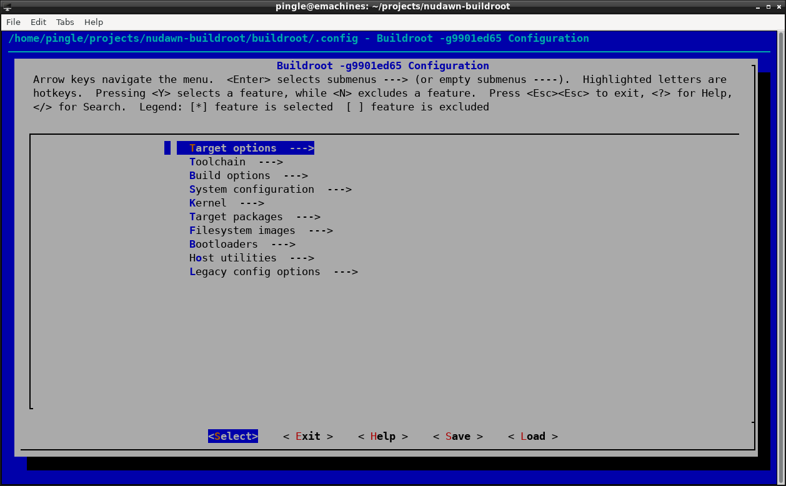
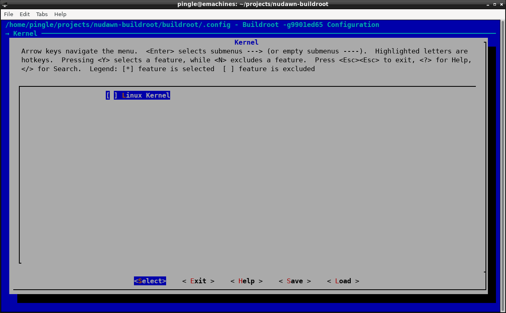
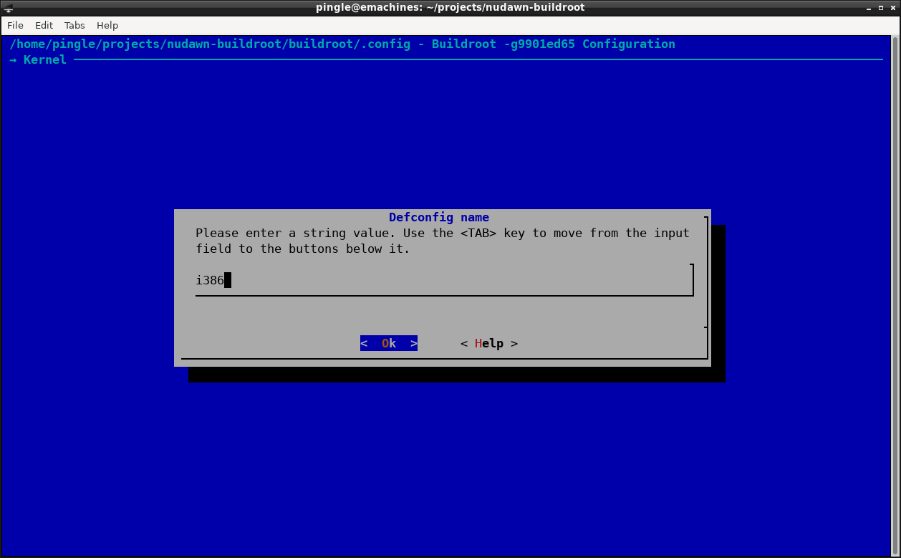
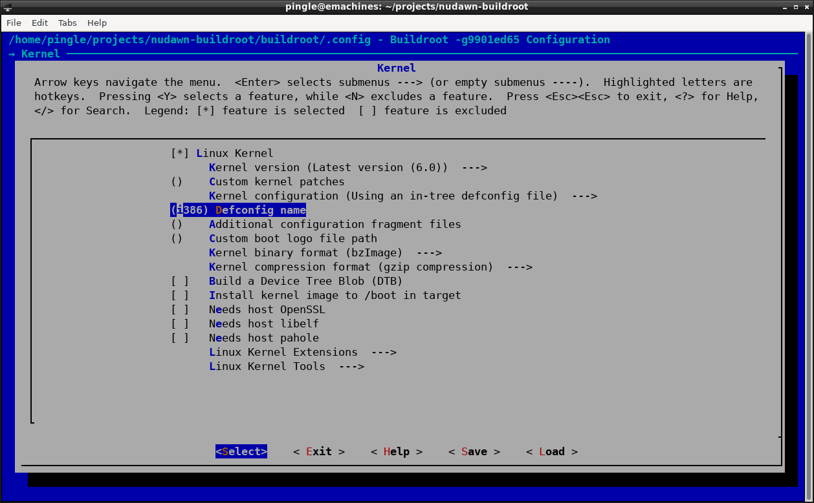
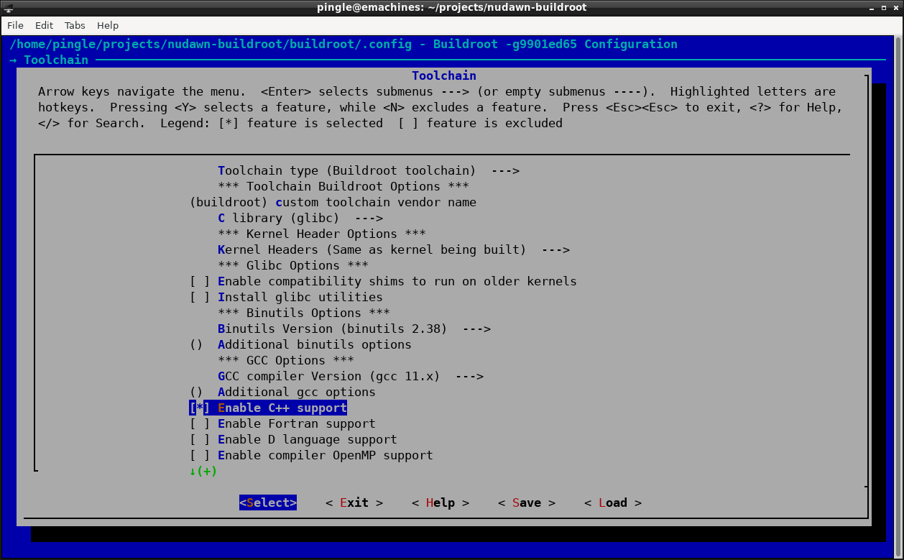
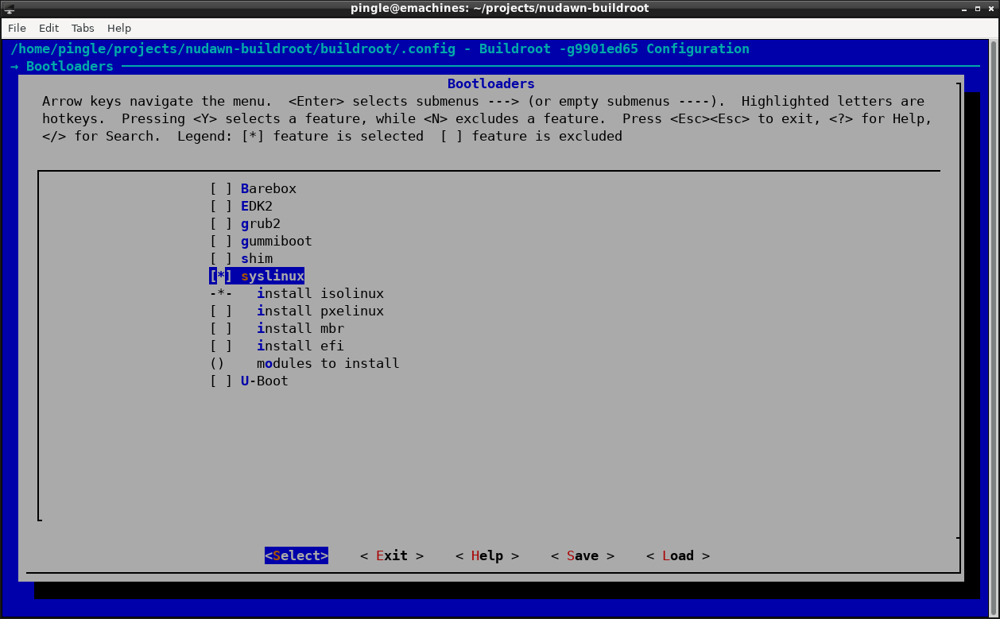
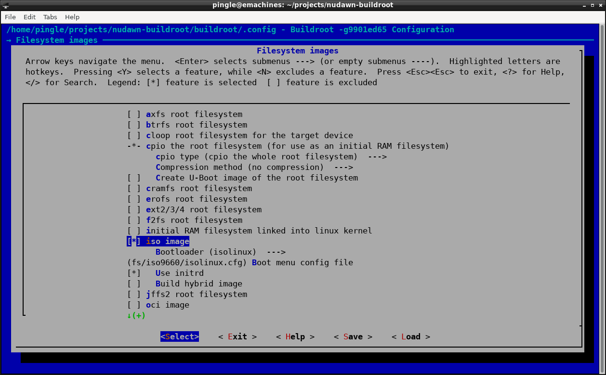
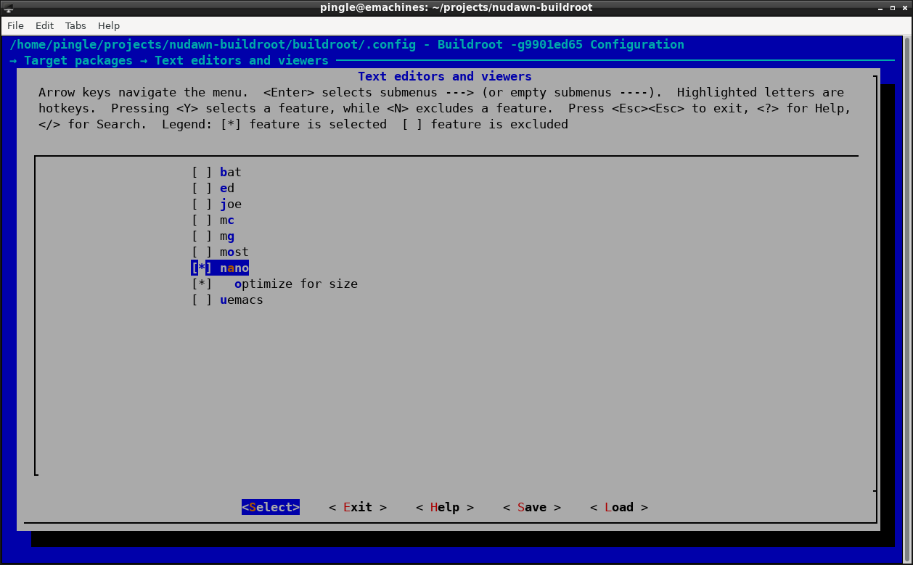
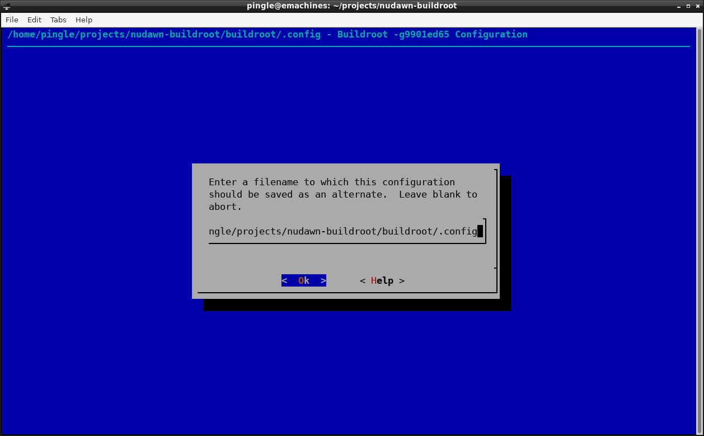

# NuDawn (by buildroot)
Starting with a clean build,

	git clone git://git.buildroot.net/buildroot

or

	make --directory buildroot clean

then following a new build

	make --directory buildroot

upon completiong, there will exists only,

	output/images/rootfs.tar

To test this with qemu,

	qemu-system-x86_64 -M pc -kernel output/images/rootfs.tar

and nothing happens, because we need a kernel,

## Configuring the Kernel
Start,

	make --directory buildroot menuconfig

	In Kernels --> Linux Kernel

               defconfig = i386

	In Toolchain --> Enable C++ Support

	In Bootloaders --> syslinux

	In Filesystem images --> isoimage

	In Target packages --> Text editors and views --> nano

	In Target packages --> Network application --> dnsmasq

then save and exit,

now configure the linux kernel by

	make --directory buildroot linux-menuconfig

then rebuild,

	make --directory buildroot

To test qemu with networking support,

	qemu-system-i386 -serial stdio -cdrom buildroot/output/images/rootfs.iso9660 -m 256 -M pc -nic user,model=virtio-net-pci

or create a test.sh

	echo qemu-system-i386 -serial stdio -cdrom buildroot/output/images/rootfs.iso9660 -m 256 -M pc -nic user,model=virtio-net-pci > test.sh && sudo chmod +x test.sh

# Additional Helpful Links
The following links can provide additional resoruces and assistance,

	https://buildroot.org/downloads/manual/manual.html)
	https://www.thirtythreeforty.net/posts/2020/01/mastering-embedded-linux-part-3-buildroot/
	https://ja.nsommer.dk/articles/linux-and-tiny-c-compiler-in-the-browser-part-one.html
	https://hackaday.com/2022/05/28/linux-and-c-in-the-browser/ 

